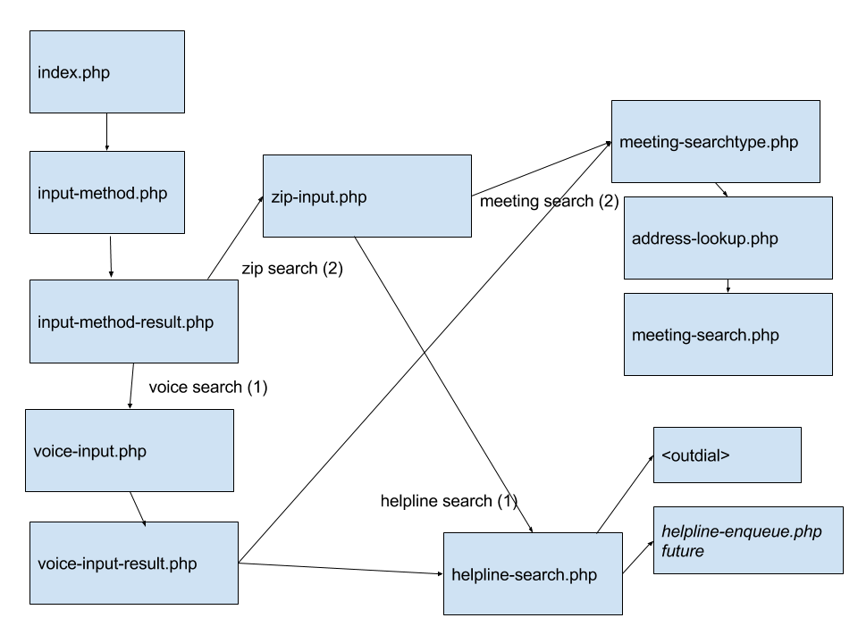

# yap

The purposes of yap are :
* To be able to take the results of a BMLT root server and play it back through the telephone.  
* To be able to set up routing rules for zip codes and helpline numbers with optional extension dialing.

Unlike it's predecessor bmlt-vox, this doesn't require any special infrastructure other than a server capable of delivering PHP over HTTP(S).

We are taking advantage of using Twilio which essentially handles all the VOIP parts.  You provision a number, set up an application, and point it your PHP server.

## Setup

1. Create a new virtual application or add the yap code to an existing folder.  The easiest way to get the code there is to upload the latest version there: https://github.com/radius314/yap/archive/master.zip.

2. Once the application is configured you will need to customize the config.php file.  There are several settings there that are documented in that file.  There are a number of different ways to utilize the yap platform.  

3. Try testing that your application actually is functioning properly by opening a browser http://example.com/index.php.  

3. You will need to set up a Twilio account, and do the following:
* Purchase a phone number (typically you would buy one for your locale, tollfree is pretty much unnecessary these days).
* Configure that number to point to a Webook.  It would be something like http://example.com/index.php.
* Ensure that you are using HTTP GET and not HTTP POST.

4. Make a call to your number and try it out.  If there is a problem the debugger in the Twilio console will let you know why.  Most likely you did not setup your config.php file correctly.

## Helpline Call Routing

The helpline router utilizes a BMLT server (2.9.0 or later), that has helpline numbers properly configured in the "Service Body Administration" section.  

The yap platform will ask for a piece of location information in turn it will look up latitude and longitude and then send that information to the BMLT root server you have configured.

You can also tie this into an existing extension based system, say for example Grasshopper.  If you want to dial an extension just add something like `555-555-5555|wwww700` for example after the helpline field on the BMLT Service Body Administration.  In this case it's instructing to dial 555-555-5555 and wait 4 seconds and then dial 700. 

## Skipping Helpline Call Routing

When configuring the TwiML app instead of pointing to `index.php` point to `input-method.php?Digits=2`.

## Call Flow

